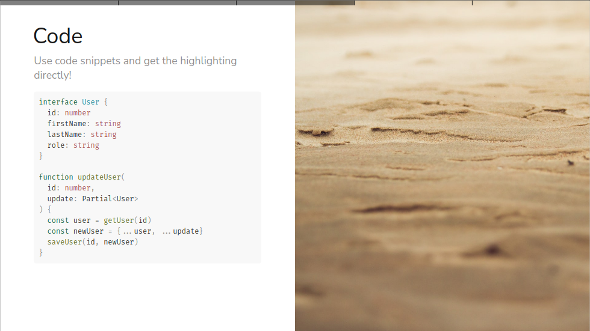
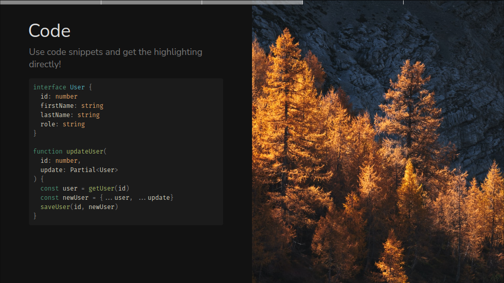

# slidev-component-progress

[](https://www.npmjs.com/package/slidev-component-progress)

Progress component for Slidev `Slidev`.  
Shows a progress bar that represents the completed percentage of the presentation.




## Installation

```bash
npm i slidev-component-progress
```

## Usage

Create a `./setup/main.ts` file in your `Slidev` project and register the plugin:
```js
import { defineAppSetup } from '@slidev/types'
import Progress from 'slidev-component-progress'

export default defineAppSetup(({ app, router }) => {
  app.use(Progress)
})
```

Create a `./global-top.vue` file in your `Slidev` project and use the component:
```vue
<template>
  <Progress level="2"/>
</template>
```

## Parameters

* `color` (type: `string`): The color of the progress bar, by default, it will use the `--slidev-theme-primary` CSS variable
* `height` (type: `string`, default: `'8px'`): Height of the progress bar
* `level` (type: `number | string`, default: `1`): Display sections in the progress bar with informations from the Table Of Content
* `opacity`  (type: `number | string`, default: `0.5`): Opacity of the progress bar
* `position` (type: `'top' | bottom'`, default: `'top'`): Position of the progress bar in the slide
* `transitionDuration` (type: `string`, default: `200ms`): CSS transition durations
